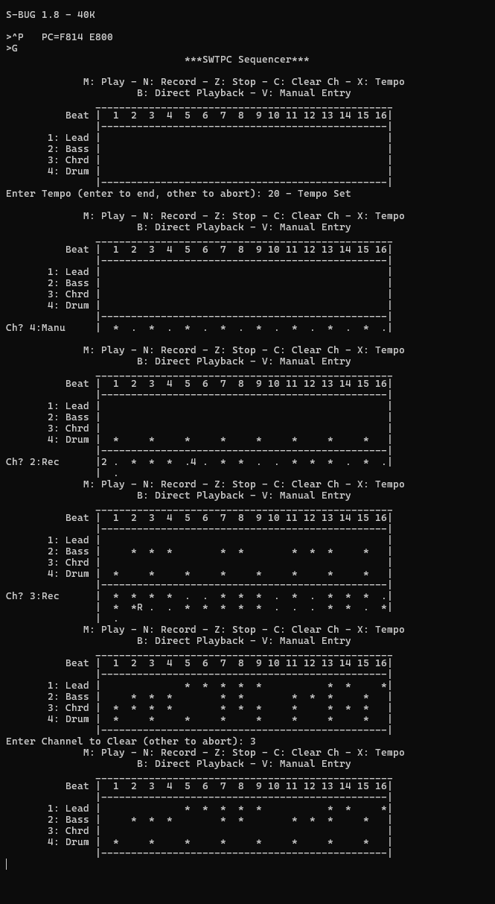

# Basic Sequencer for SWTPC 6809

## Features
* Recording on four different channels
    * 3 synth channels, 1 drum channel
    * Five octaves supported (0-5V output with 1V/oct) on synth channels
    * 8 drums supported on drum channel, multiple drums played simultaneously
    * Switching between channels while recording
    * Switching between recording and playback
    * Clearing of channel while recording
    * Erasing of previously played note with `.`
    * Live preview of notes as they are recorded
* Playback of recorded sequence
* Clearing of entered channel data
* Changing tempo of playback
* Direct Control of channel instruments
* Manual entry of channel data

## Input Configuration
* Menu keys are on bottom row of keyboard
* Synth Recording
    * Select channels with number keys
    * Piano keys starting on A, ending on ', with sharps and flats on W-P
    * Recording control on bottom row
        * Z to stop
        * M to change to playback
        * N to change recording channel
        * C to clear the current channel that is being recorded
* Drum Recording
    * Drums recorded with number keys 1-8
    * Multiple drums can be played in the same beat
    * Recording control on bottom row, same as synth recording
* Manual entry follows the same keys as recording
* Direct playback follows the same keys, but the only control key is stop

## Configured Memory Map
* ROM Loaded at 0xE800
* SBug loaded at 0xF800
* Scratch RAM at 0x4000-0x4050
* Audio DAC at 0xE020-0xE023
* Drum channel at 0xE024 (one bit per drums)
* DAC gate at 0xE028 (one bit per channel, supports both synth and drum gates)
* MC6850 Serial Card

## Sequencer in Action

